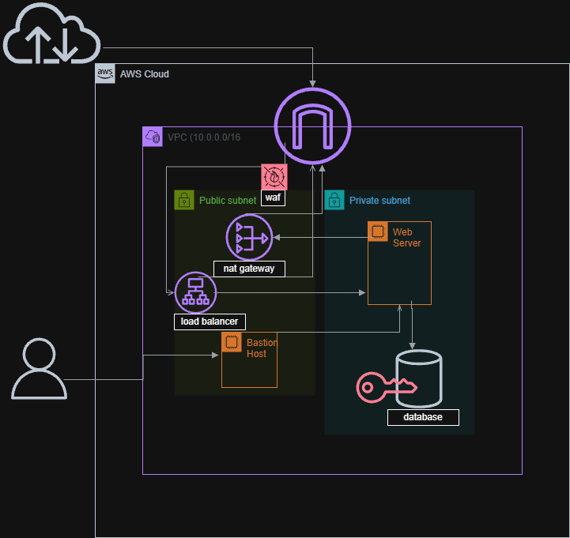

# Secure 3-Tier Architecture on AWS 🛡️

## Project Overview
This project demonstrates a secure, scalable, and high-availability cloud infrastructure designed on AWS. It follows the "Security by Design" principle, utilizing VPC segmentation, encryption, and strict access controls.

## 🏗️ Architecture Highlights

### 1. Network Security (VPC & Subnets)
* **Custom VPC:** Built an isolated network environment (10.0.0.0/16).
* **Subnet Segmentation:**
    * **Public Subnet:** Hosts the Load Balancer, NAT Gateway, and Bastion Host.
    * **Private Subnet:** Hosts the critical Web Server and Database (No direct internet access).

### 2. Access Control & Traffic Flow
* **Internet Gateway (IGW):** Manages inbound/outbound traffic for the VPC.
* **Application Load Balancer (ALB):** Distributes incoming web traffic to the private web server.
* **NAT Gateway:** Allows the private web server to download updates securely without exposing its IP.
* **Bastion Host:** A secure "Jump Server" for SSH access to the private web server.

### 3. Security & Compliance
* **AWS WAF (Web Application Firewall):** Protects the application from common web exploits (SQL Injection, XSS).
* **Data Encryption:** The RDS Database is encrypted using AWS KMS (Key Management Service) to protect sensitive data at rest.
* **Security Groups:** Acts as a virtual firewall to control inbound and outbound traffic at the instance level.

## 🛠️ Technology Stack
* **Compute:** Amazon EC2
* **Networking:** VPC, Subnets, Route Tables, IGW, NAT Gateway
* **Security:** IAM, Security Groups, WAF, KMS
* **Database:** Amazon RDS (Encrypted)
* **Load Balancing:** Application Load Balancer (ALB)
